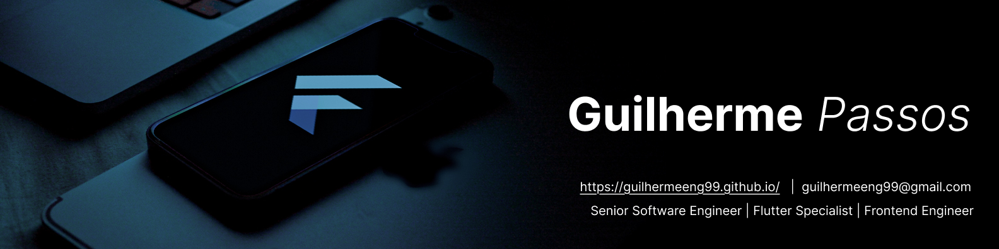
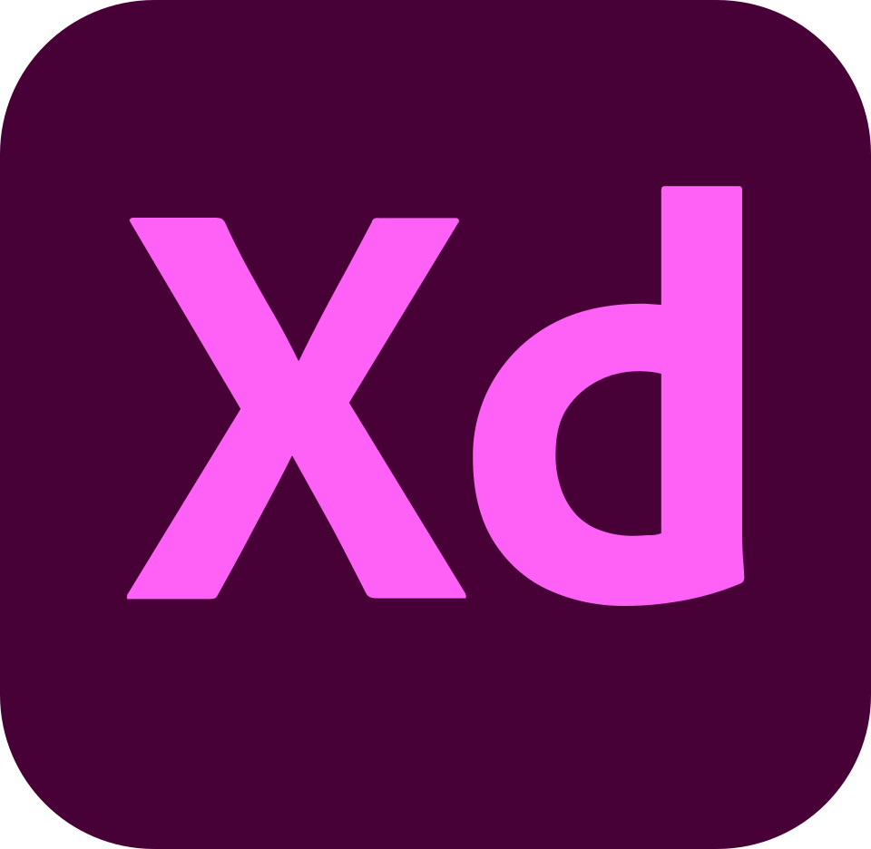

Hey! I'm Guilherme 👋

Flutter Mobile Developer focused on building scalable mobile apps and games used by millions of users worldwide.

I turn ideas into high-performance mobile products — from architecture and clean code to monetization systems, live operations, and global publishing.

Currently building and scaling mobile products with Flutter + Firebase 🚀

### **About me**

- 📱 5+ years building mobile apps & games
- 🌍 Products reaching **15M+ downloads worldwide**
- 🏆 Google Play Indie Games Accelerator 2024 — Winner
- 🏆 Google Play Indie Games Fund 2023 — Winner
- 🏆 Google Play Best of 2021 — Nominee
- 📍 Brazil — Open to Remote (USD / EUR)

---

### **What I Actually Do**

- Architect scalable Flutter applications (Clean Architecture, MVVM)
- Build high-performance UI & complex animations
- Optimize memory usage, reduce ANRs, improve rendering efficiency
- Design monetization systems (Ads, bidding, eCPM optimization)
- Implement Live Ops systems (events, leaderboards, ranking systems)
- Work with full Firebase ecosystem
- Set up CI/CD pipelines for mobile products

## 🚀 Featured Products

### 🧩 Magic Sort — Hybrid Casual Game
[🔗 View on AppMagic](https://appmagic.rocks/google-play/magic-sort/com.blu.wsp) · 🏆 [Google Play Indie Games Accelerator 2024 Winner](https://android-developers.googleblog.com/2024/03/meet-class-of-2024-for-google-play-indie-games-accelerator.html)

- **480K+ downloads** in first months
- Flutter + Firebase
- High-performance UI systems
- Monetization & Live Events architecture

---

### 🐰 Rabit — Gamified Habit Tracker
[🔗 View on AppMagic](https://appmagic.rocks/google-play/rabit/com.blu.rabito) · 🏆 [Google Play Best of 2021 Nominee](https://blog.google/products-and-platforms/platforms/google-play/google-plays-best-of-2021/)

- **3.5M+ downloads**
- Cloud sync, notifications, analytics
- Full Firebase integration

---

### 🧃 Cups — Casual Puzzle Game
[🔗 View on AppMagic](https://appmagic.rocks/ipad/cups/1541421297)

- **4.5M+ downloads**
- Strong traction in US market
- Full ads & monetization system
- Scalable ranking systems

---

### 👽 Farm vs Aliens — Tower Defense
[🔗 View on Google Play](https://play.google.com/store/apps/details?gl=US&hl=en-US&id=com.blu.farmvsaliens) · 🏆 [Google Play Indie Games Fund 2023 Winner](https://blog.google/products-and-platforms/platforms/google-play/10-studios-selected-for-google-plays-2023-indie-games-fund/)

- Product direction & monetization strategy

---

### 🐹 Capy: Self-Care Pet — Virtual Pet App
[🔗 View on AppMagic](https://appmagic.rocks/iphone/capy-self-care-pet/6739744609)

- Flutter

---

### 🔵 Drop & Merge — Casual Puzzle Game
[🔗 View on AppMagic](https://appmagic.rocks/iphone/drop-and-merge/1559407907)

- Flutter

<h3><b>💻 Core Technologies</b></h3>

<b>Core</b>&nbsp;&nbsp;

 &nbsp;&nbsp;  &nbsp;&nbsp;  &nbsp;&nbsp;  &nbsp;&nbsp;

Riverpod • Bloc • MobX • TDD • Clean Architecture

<b>Backend & Cloud</b>

 &nbsp;&nbsp;  &nbsp;&nbsp;  &nbsp;&nbsp;  &nbsp;&nbsp; 

Firebase (Auth, Firestore, FCM, Remote Config, Storage) • Node.js • GraphQL • REST APIs

<b>Product & Growth</b>

 &nbsp;&nbsp;  &nbsp;&nbsp;   &nbsp;&nbsp; 

ASO • Monetization • Ads Optimization • CI/CD (GitHub Actions, Codemagic)

### 📫 Let's Connect

- 💼 [LinkedIn](https://www.linkedin.com/in/guiga-passos/)
- 📧 [guilhermeeng99@gmail.com](mailto:guilhermeeng99@gmail.com)
- 🐙 [GitHub](https://github.com/guilhermeeng99)

> Building mobile products that scale. Always learning. Always optimizing.
