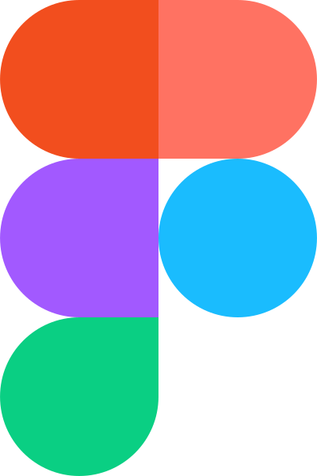
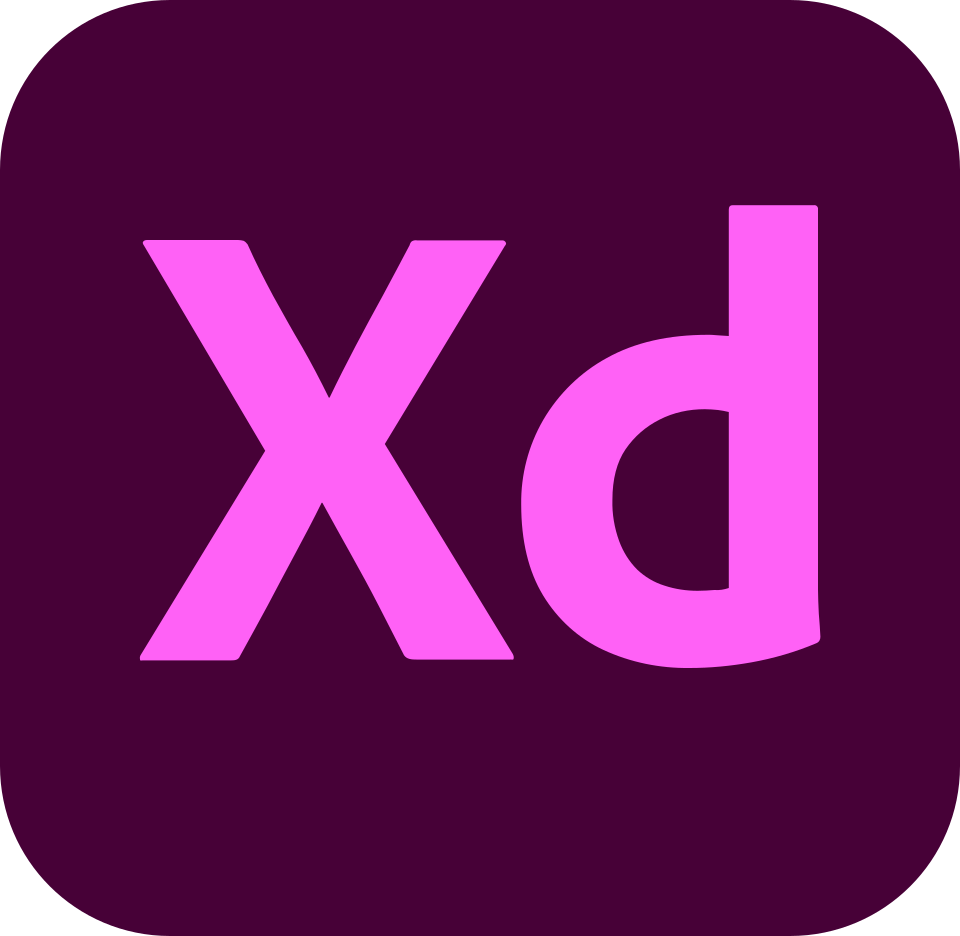

<!-- Header -->

Hey! I'm Guilherme 👋

Senior Flutter Engineer with 7+ years of experience building and scaling high-performance mobile applications and games from concept to live operations.

I turn ideas into high-performance mobile products — from architecture and clean code to monetization systems, live operations, and global publishing.

Currently building and scaling mobile products with Flutter + Firebase 🚀

<!-- About Me -->
### **About me**

- 📱 7+ years building mobile apps & games
- 🌍 Products reaching **12M+ downloads worldwide**
- 🏆 Google Play Indie Games Accelerator 2024 — Winner
- 🏆 Google Play Indie Games Fund 2023 — Winner
- 🏆 Google Play Best of 2021 — Nominee
- 📍 Brazil — Open to Remote (USD / EUR)

<!-- What I Do -->
### **What I Actually Do**

- Architect scalable Flutter applications (Clean Architecture, MVVM)
- Build high-performance UI & complex animations
- Optimize memory usage, reduce ANRs, improve rendering efficiency
- Design monetization systems (Ads, bidding, eCPM optimization)
- Implement Live Ops systems (events, leaderboards, ranking systems)
- Work with full Firebase ecosystem
- Set up CI/CD pipelines for mobile products

<!-- Featured Products -->
## 🚀 Featured Products

### 🧩 Magic Sort — Hybrid Casual Game

<a href="https://appmagic.rocks/google-play/magic-sort/com.blu.wsp" target="_blank">🔗 View on AppMagic</a> ·
🏆 <a href="https://android-developers.googleblog.com/2024/03/meet-class-of-2024-for-google-play-indie-games-accelerator.html" target="_blank">Google Play Indie Games Accelerator 2024 Winner</a>

- **1M+ downloads** in first months
- Flutter + Firebase
- High-performance UI systems
- Monetization & Live Events architecture

### 🐰 Rabit — Gamified Habit Tracker

<a href="https://appmagic.rocks/google-play/rabit/com.blu.rabito" target="_blank">🔗 View on AppMagic</a> ·
🏆 <a href="https://blog.google/products-and-platforms/platforms/google-play/google-plays-best-of-2021/" target="_blank">Google Play Best of 2021 Nominee</a>

- **5M+ downloads**
- Cloud sync, notifications, analytics
- Full Firebase integration

### 🐹 Capy: Self-Care Pet — AI-Powered Virtual Wellness Companion

<a href="https://appmagic.rocks/iphone/capy-self-care-pet/6739744609" target="_blank">🔗 View on AppMagic</a>

- AI-powered self-care app featuring a virtual pet driven by **OpenAI APIs**
- Combines habit tracking, mood journaling, and intelligent conversational interactions
- Built scalable daily engagement loops using push notifications and behavioral tracking
- High-performance UI architecture
- Flutter + Firebase

### 🧃 Cups — Casual Puzzle Game

<a href="https://appmagic.rocks/ipad/cups/1541421297" target="_blank">🔗 View on AppMagic</a>

- **4.5M+ downloads**
- Strong traction in US market
- Full ads & monetization system
- Scalable ranking systems

### 👽 Farm vs Aliens — Tower Defense

<a href="https://play.google.com/store/apps/details?gl=US&hl=en-US&id=com.blu.farmvsaliens" target="_blank">🔗 View on Google Play</a> ·
🏆 <a href="https://blog.google/products-and-platforms/platforms/google-play/10-studios-selected-for-google-plays-2023-indie-games-fund/" target="_blank">Google Play Indie Games Fund 2023 Winner</a>

- Product direction & monetization strategy

### 🔵 Drop & Merge — Casual Puzzle Game

<a href="https://appmagic.rocks/iphone/drop-and-merge/1559407907" target="_blank">🔗 View on AppMagic</a>

- Flutter

<!-- Core Technologies -->
### 💻 Core Technologies

<!-- Core -->
<b>Core</b>

&nbsp;&nbsp;

&nbsp;&nbsp;

&nbsp;&nbsp;

Riverpod • Bloc • Cubit • MobX • Provider • GetX
 
TDD • Clean Architecture • MVVM • SOLID • DDD • DRY • KISS • OOP

<!-- Backend & Cloud -->
<b>Backend & Cloud</b>

&nbsp;&nbsp;

&nbsp;&nbsp;

&nbsp;&nbsp;

&nbsp;&nbsp;

&nbsp;&nbsp;

Firebase (Auth, Firestore, FCM, Remote Config, Storage, Crashlytics, Analytics)
 
Supabase • Node.js • GraphQL • REST APIs • WebSockets • Platform Channels
 
Hive • Drift • Isar • Realtime Database • GetIt • Modular

<!-- DevOps & Observability -->
<b>DevOps & Observability</b>

&nbsp;&nbsp;

&nbsp;&nbsp;

CI/CD Pipelines • Fastlane • CodeMagic • Firebase App Distribution
 
NewRelic • Braze • Optimizely
 
Performance Optimization • Crash & ANR Reduction • Memory Leak Debugging • Build Flavors

<!-- Product & Growth -->
<b>Product & Growth</b>

&nbsp;&nbsp;

&nbsp;&nbsp;

&nbsp;&nbsp;

ASO • Monetization • Ads Optimization • CI/CD (GitHub Actions, Codemagic)

<!-- Resume -->
### 📄 Resume

<a href="assets/pdfs/Guilherme_Passos_Resume.pdf" target="_blank">📥 Download my Resume (PDF)</a>

<!-- Contact -->
### 📫 Let's Connect

- 💼 <a href="https://www.linkedin.com/in/guigapassos/" target="_blank">LinkedIn</a>
- 📧 <a href="mailto:guilhermeeng99@gmail.com">guilhermeeng99@gmail.com</a>
- 🐙 <a href="https://github.com/guilhermeeng99" target="_blank">GitHub</a>

> Building mobile products that scale. Always learning. Always optimizing.
